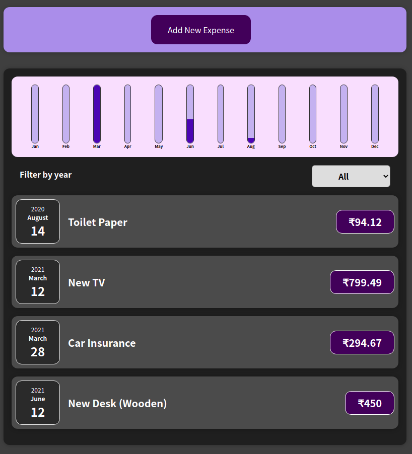
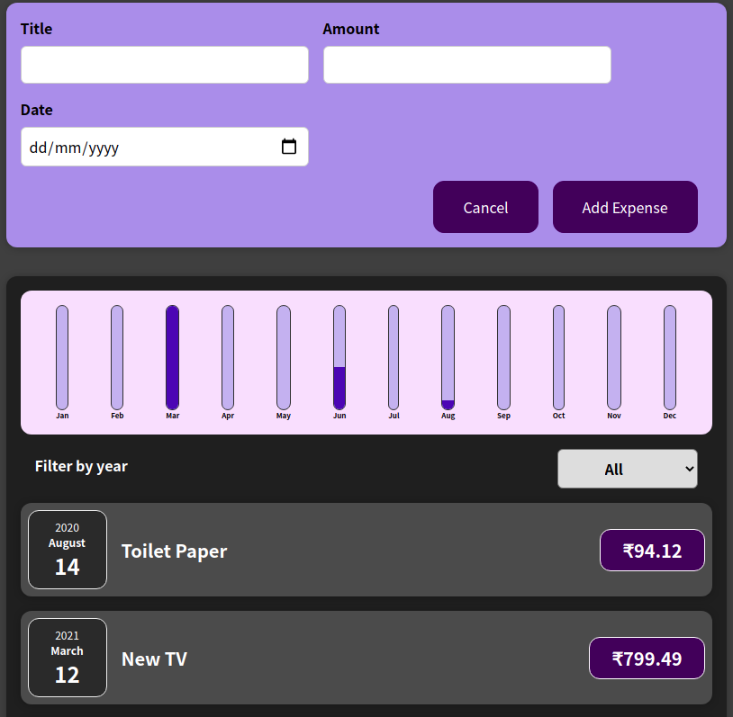

# Welcome
This is a react application to manage monthly expenses.

# Credits
Credits [Udemy Course](https://www.udemy.com/course/react-the-complete-guide-incl-redux/)

# Instructions
To install the dependencies of the app run
```bash
npm install
```

To run the app use
```bash
npm start
```

# Screenshots


